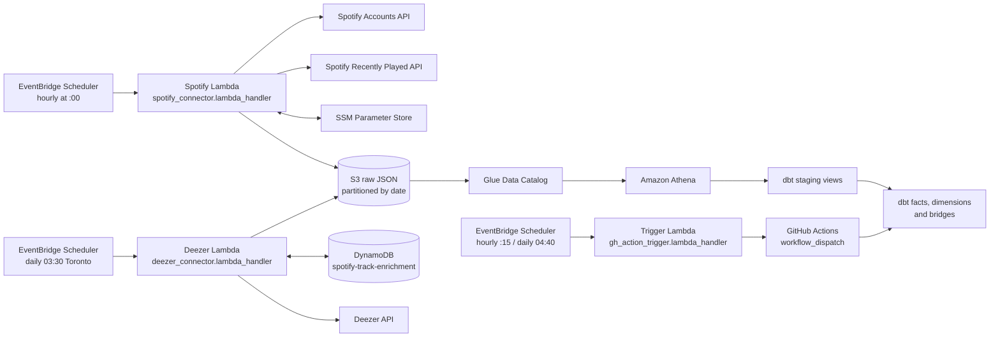

# Spotify Listening History Warehouse

An automated personal analytics pipeline that collects Spotify recently played tracks, enriches albums with Deezer genres, stores raw API responses in Amazon S3, exposes them through AWS Glue and Athena, and transforms them into an analytics-ready star schema with dbt.

The ingestion Lambda runs hourly. Fifteen minutes later, EventBridge Scheduler dispatches the GitHub Actions dbt workflow to refresh the Spotify models. A daily Deezer enrichment Lambda runs at 03:30 Toronto time, followed by a full dbt build at 04:40.

## Architecture



Pipeline sequence:

1. EventBridge invokes Lambda at the beginning of every hour.
2. Lambda exchanges the stored Spotify refresh token for an access token.
3. It requests up to 50 plays newer than the cursor in Parameter Store.
4. Each play is written as an individual JSON object under a date-partitioned S3 path.
5. The cursor advances only after every S3 write completes.
6. Athena reads the JSON through `spotify_raw.recently_played`.
7. At minute 15, EventBridge Scheduler invokes the trigger Lambda, which dispatches the dbt workflow with `mode: spotify`.
8. GitHub Actions assumes an AWS role through OIDC and runs `dbt build` on the Spotify models.
9. Daily at 03:30 Toronto, the Deezer Lambda looks up genres for new albums by ISRC.
10. Daily at 04:40 Toronto, the trigger Lambda dispatches a full build with `mode: full`.

## Repository layout

```text
.
|-- spotify_connector.py
|-- deezer_connector.py
|-- gh_action_trigger.py
|-- lambda-requirements.txt
|-- ddl/
|   |-- recently_played_athena.sql
|   `-- album_genres_athena.sql
|-- spotify_dbt/
|   |-- dbt_project.yml
|   |-- packages.yml
|   |-- requirements.txt
|   |-- models/
|   |   |-- spotify/
|   |   |   |-- staging/
|   |   |   `-- marts/
|   |   `-- deezer/
|   |       |-- staging/
|   |       `-- marts/
|   `-- tests/
`-- .github/
    |-- dbt/profiles.yml
    `-- workflows/dbt-production.yml
```

## Spotify ingestion Lambda

### Runtime configuration

| Setting | Value |
| --- | --- |
| Runtime | Python 3.12 |
| Handler | `spotify_connector.lambda_handler` |
| Timeout | At least 30 seconds |
| EventBridge schedule | `cron(0 * * * ? *)` |
| Invocation | At minute 0 every hour |

The function requires outbound internet access to Spotify. A VPC-attached Lambda needs a NAT route from its selected subnets.

### Environment variables

| Variable | Example | Purpose |
| --- | --- | --- |
| `SSM_PREFIX` | `/spotify` | Parameter path prefix; omit a trailing slash. |
| `RAW_BUCKET` | `my-spotify-data-bucket` | S3 bucket receiving raw JSON. |
| `RAW_PREFIX` | `raw/spotify/recently_played` | Object prefix; omit leading and trailing slashes. |

With `SSM_PREFIX=/spotify`, create:

| Parameter | Type | Purpose |
| --- | --- | --- |
| `/spotify/client_id` | `SecureString` | Spotify application client ID |
| `/spotify/client_secret` | `SecureString` | Spotify client secret |
| `/spotify/refresh_token` | `SecureString` | Current OAuth refresh token |
| `/spotify/cursor` | `String` | Last successful `after` cursor in epoch milliseconds |

Initialize `cursor` before the first invocation. A value of `0` requests the most recent available page, not unlimited account history.

### Lambda permissions

In addition to `AWSLambdaBasicExecutionRole`, grant:

- `ssm:GetParameter` for the four parameters.
- `ssm:PutParameter` for the cursor and rotated refresh token.
- `s3:PutObject` for the raw prefix.
- KMS decrypt and encrypt permissions when SecureStrings use a customer-managed key.

Scope permissions to the exact parameter path, bucket prefix, and KMS key.

### Packaging

Lambda includes `boto3`; package `requests` with the function or use a Lambda layer.

```bash
mkdir -p lambda-package
python -m pip install --requirement lambda-requirements.txt --target lambda-package
cp spotify_connector.py lambda-package/
cd lambda-package
zip -r ../spotify-lambda.zip .
```

Upload the ZIP and configure `spotify_connector.lambda_handler`.

### Storage behavior

Objects follow this layout:

```text
s3://<bucket>/<raw-prefix>/dt=2026-09-29/1759135400000.json
```

The timestamp key makes retries idempotent for one account. For multiple accounts, include an account identifier in the S3 key and dbt primary key.

The request is limited to 50 plays. Hourly execution makes exceeding that page unlikely for normal track lengths, but pagination and an ingestion audit are needed for strict no-loss guarantees.

## Deezer genre enrichment Lambda

[`deezer_connector.py`](deezer_connector.py) adds genres to albums. On each run it:

1. Queries `spotify_analytics.stg_spotify__plays` in Athena for one ISRC per album.
2. Skips albums already recorded in the `spotify-track-enrichment` DynamoDB table with status `completed`, `no_match`, or `no_genre`.
3. Resolves each remaining album through the Deezer track-by-ISRC endpoint, then fetches the Deezer album's genres.
4. Writes one JSON record per album to `s3://<bucket>/raw/deezer/albums/dt=YYYY-MM-DD/<album_id>.json` and records its status in DynamoDB.

| Status | Meaning | Retried |
| --- | --- | --- |
| `completed` | Genres found | No |
| `no_match` | No Deezer track for the ISRC | No |
| `no_genre` | Deezer album has no genres | No |
| `error` | Genre request failed | Yes, next run |

| Setting | Value |
| --- | --- |
| Runtime | Python 3.12 |
| Handler | `deezer_connector.lambda_handler` |
| EventBridge schedule | `cron(30 3 * * ? *)`, time zone `America/Toronto` |
| Packaging | Same as the Spotify Lambda (`requests` required) |

The bucket, Athena result location, and DynamoDB table name are set in the module. Set a timeout long enough for the first backfill: each album costs two Deezer requests plus a 0.2 second pause.

The execution role needs Athena query access, Glue and S3 read access for `stg_spotify__plays`, read/write access to the Athena results prefix, `dynamodb:Scan` and `dynamodb:PutItem` on the table, and `s3:PutObject` on `raw/deezer/albums/`.

dbt reads the records through `deezer_raw.album_genres`, defined in [`ddl/album_genres_athena.sql`](ddl/album_genres_athena.sql).

## dbt workflow trigger Lambda

GitHub's `schedule` trigger is best-effort and regularly delays or drops runs, so the dbt workflow has no `schedule:` block. EventBridge Scheduler invokes [`gh_action_trigger.py`](gh_action_trigger.py) instead, which calls the GitHub `workflow_dispatch` API.

| Schedule | Cron expression | Time zone | Payload |
| --- | --- | --- | --- |
| Hourly Spotify models | `cron(15 * * * ? *)` | UTC | `{"mode": "spotify"}` |
| Daily full build | `cron(40 4 * * ? *)` | `America/Toronto` | `{"mode": "full"}` |

| Setting | Value |
| --- | --- |
| Function name | `trigger-spotify-dbt-github-action` |
| Runtime | Python 3.12 |
| Handler | `gh_action_trigger.lambda_handler` |
| Dependencies | None (`boto3` and `urllib` only) |

The payload's `mode` is passed to the workflow's `mode` input. A missing `mode` defaults to `full`. A `204` response means the run was dispatched.

### GitHub token

Store a fine-grained personal access token as a `SecureString` at `/github/spotify/access_token`. Limit it to this repository with **Actions: Read and write** permission (GitHub adds **Metadata: Read-only** automatically), and give it an expiry date. An expired token makes every dispatch fail with `401`.

The token is cached for the life of a warm Lambda container. After rotating it, update the function configuration to force a cold start.

### Trigger permissions

The Lambda execution role needs `AWSLambdaBasicExecutionRole` and `ssm:GetParameter` on `arn:aws:ssm:us-east-1:<account-id>:parameter/github/spotify/access_token`. Add `kms:Decrypt` only if the parameter uses a customer-managed key.

The schedules need a separate role trusted by `scheduler.amazonaws.com` with `lambda:InvokeFunction` on the function. Choose **Create new role for this schedule** in the console; the Lambda's own execution role cannot be assumed by Scheduler.

## Athena source

Run [`ddl/recently_played_athena.sql`](ddl/recently_played_athena.sql) after creating the `spotify_raw` database, and [`ddl/album_genres_athena.sql`](ddl/album_genres_athena.sql) after creating the `deezer_raw` database.

`deezer_album_id` is null for `no_match` records.

Both DDLs use partition projection, so new `dt=` folders are queryable without crawlers or `MSCK REPAIR TABLE`. When deploying elsewhere, update the table location, `storage.location.template`, and start of `projection.dt.range`.

## dbt models

Models are grouped by source under `models/spotify/` and `models/deezer/`.

### Staging

| Model | Grain |
| --- | --- |
| `stg_spotify__plays` | One row per play |
| `stg_spotify__track_artists` | One row per track and credited artist |
| `stg_spotify__album_artists` | One row per album and credited artist |
| `stg_deezer__album_genres` | One row per album, latest Deezer lookup |

### Marts

| Model | Grain |
| --- | --- |
| `fct_plays` | One row per play, incrementally merged as Iceberg |
| `dim_track` | One row per track |
| `dim_album` | One row per album |
| `dim_artist` | One row per artist |
| `dim_date` | One row per date |
| `bridge_artist_track` | One row per track and artist |
| `bridge_artist_album` | One row per album and artist |
| `dim_genres` | One row per Deezer genre |
| `bridge_album_genre` | One row per album and genre |

A fact row is a play event, not proof that the full track was heard. `duration_ms` is full track duration, not actual listening time.

The project stores UTC and `America/Toronto` timestamps. Make timezone an account-level setting before supporting users in other regions.

## Local dbt development

```bash
cd spotify_dbt
python -m venv .venv
source .venv/bin/activate
python -m pip install --requirement requirements.txt
dbt deps
```

Example `~/.dbt/profiles.yml`:

```yaml
spotify_dbt:
  target: dev
  outputs:
    dev:
      type: athena
      database: awsdatacatalog
      schema: spotify_analytics
      region_name: us-east-1
      s3_data_dir: s3://YOUR_BUCKET/warehouse/
      s3_staging_dir: s3://YOUR_BUCKET/athena-results/
      aws_profile_name: YOUR_LOCAL_AWS_PROFILE
      threads: 4
```

Run:

```bash
dbt debug
dbt parse
dbt build
```

`dbt build` creates models in dependency order and runs data tests covering keys, nullability, relationships, main-artist attribution, and track-to-album consistency.

## Production dbt deployment

The [production workflow](.github/workflows/dbt-production.yml) runs:

- On relevant changes pushed to `main`, as a full build.
- Through `workflow_dispatch`, from the [trigger Lambda](#dbt-workflow-trigger-lambda) or manually from the Actions tab.

The `mode` input selects what is built:

| `mode` | Runs |
| --- | --- |
| `spotify` | `dbt build --select path:models/spotify` |
| `full` (default) | `dbt build` |

Pushes send no input and therefore run a full build.

The workflow uses GitHub OIDC to assume `github-actions-spotify-dbt-prod`; it stores no permanent AWS keys.

Create a GitHub environment named `production` with:

| Variable | Purpose |
| --- | --- |
| `AWS_DBT_ROLE_ARN` | Deployment role ARN |
| `AWS_ACCOUNT_ID` | Expected account ID |
| `DBT_S3_DATA_DIR` | S3 location for dbt table data |
| `DBT_S3_STAGING_DIR` | S3 location for Athena results |

Restrict the environment and IAM OIDC subject to this repository and `main`. The role needs Athena query access, read access to `spotify_raw`, relation-management access to `spotify_analytics`, Glue table-version access, raw S3 read access, and read/write/delete access to warehouse and query-result prefixes.

## Monitoring

Ingestion checks:

- EventBridge invocation history.
- Lambda errors, duration, and throttles in CloudWatch.
- The `spotify_ingestion_complete` log and `added_items` value.
- Cursor update time in Parameter Store.

Enrichment checks:

- Deezer Lambda errors and duration in CloudWatch.
- Albums left in `error` status in DynamoDB.

Transformation checks:

- EventBridge Scheduler invocation metrics and trigger Lambda errors.
- The `dbt production` workflow in GitHub Actions, where scheduled runs appear as `workflow_dispatch` events.
- Uploaded `manifest.json`, `run_results.json`, and `dbt.log`.
- dbt test and Athena errors.
- Staging-to-fact parity after a successful build.

A play timestamp is not a reliable ingestion-health signal because no listening is valid. Add an audit record with invocation time, cursor, item count, status, and request ID for strict freshness monitoring.

## Troubleshooting

### OIDC role assumption fails

For `sts:AssumeRoleWithWebIdentity`, check the `sts.amazonaws.com` audience, repository subject, role ARN, and `production` environment.

### Scheduled dbt runs do not appear

Check the trigger Lambda's CloudWatch logs. No logs means Scheduler could not invoke it: confirm the schedule's execution role trusts `scheduler.amazonaws.com`. Otherwise:

- `401`: the GitHub token is invalid or expired.
- `404`: the token cannot see the repository or lacks Actions permission.
- `422`: the workflow on `main` does not accept the `mode` input, or `mode` is not `full` or `spotify`.

### Glue table-version access is denied

Grant `glue:GetTableVersion`, `glue:GetTableVersions`, and `glue:DeleteTableVersion` to the dbt role.

### Lambda writes no objects

Check `RAW_BUCKET`, `RAW_PREFIX`, `s3:PutObject`, the Spotify item count, and cursor. Zero items can be legitimate.

### Staging is ahead of the fact table

Staging models are views over raw data; `fct_plays` changes only when dbt runs. Check the dispatched workflow after the latest Lambda invocation.

### Athena cannot read a date

Confirm the S3 path is `dt=YYYY-MM-DD/` and that the date is inside the DDL partition-projection range. This applies to both `spotify_raw.recently_played` and `deezer_raw.album_genres`.

## Security

- Never commit Spotify secrets, AWS keys, `.env`, or local AWS profiles.
- Keep Spotify secrets and the GitHub token in encrypted Parameter Store values.
- Scope the GitHub token to this repository and Actions only.
- Use OIDC and temporary AWS credentials in GitHub.
- Give Lambda and dbt separate least-privilege roles.
- Treat raw listening history as personal data.

## Limitations

- One Spotify account is supported.
- Recently played is bounded recent history, not a complete account export.
- Track duration is not actual listening duration.
- Dimensions reflect metadata observed in play payloads.
- No ingestion audit table exists yet.
- Genres come from Deezer at album level and are missing for albums Deezer cannot match by ISRC.
