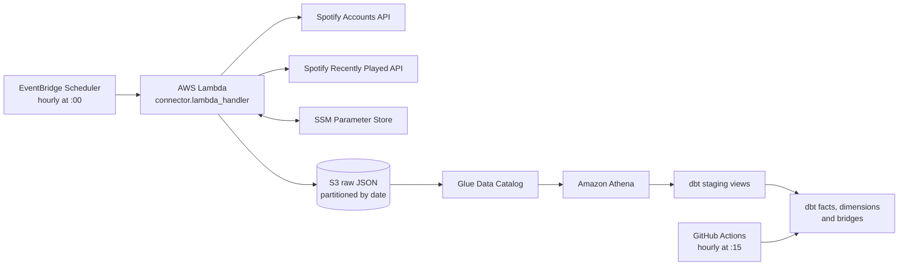

# Spotify Listening History Warehouse

An automated personal analytics pipeline that collects Spotify recently played tracks, stores raw API responses in Amazon S3, exposes them through AWS Glue and Athena, and transforms them into an analytics-ready star schema with dbt.

The ingestion Lambda runs hourly. GitHub Actions runs dbt fifteen minutes later, allowing raw records to land before analytical models are refreshed and tested.

## Architecture



Pipeline sequence:

1. EventBridge invokes Lambda at the beginning of every hour.
2. Lambda exchanges the stored Spotify refresh token for an access token.
3. It requests up to 50 plays newer than the cursor in Parameter Store.
4. Each play is written as an individual JSON object under a date-partitioned S3 path.
5. The cursor advances only after every S3 write completes.
6. Athena reads the JSON through `spotify_raw.recently_played`.
7. GitHub Actions assumes an AWS role through OIDC and runs `dbt build` at minute 15.

## Repository layout

```text
.
|-- connector.py
|-- lambda-requirements.txt
|-- ddl/
|   `-- recently_played_athena.sql
|-- spotify_dbt/
|   |-- dbt_project.yml
|   |-- packages.yml
|   |-- requirements.txt
|   |-- models/
|   |   |-- staging/
|   |   `-- marts/
|   `-- tests/
`-- .github/
    |-- dbt/profiles.yml
    `-- workflows/dbt-production.yml
```

## Lambda ingestion

### Runtime configuration

| Setting | Value |
| --- | --- |
| Runtime | Python 3.12 |
| Handler | `connector.lambda_handler` |
| Timeout | At least 30 seconds |
| EventBridge schedule | `cron(0 * * * ? *)` |
| Invocation | At minute 0 every hour |

The function requires outbound internet access to Spotify. A VPC-attached Lambda needs a NAT route from its selected subnets.

### Environment variables

| Variable | Example | Purpose |
| --- | --- | --- |
| `SSM_PREFIX` | `/spotify` | Parameter path prefix; omit a trailing slash. |
| `RAW_BUCKET` | `my-spotify-data-bucket` | S3 bucket receiving raw JSON. |
| `RAW_PREFIX` | `raw/spotify/recently_played` | Object prefix; omit leading and trailing slashes. |

With `SSM_PREFIX=/spotify`, create:

| Parameter | Type | Purpose |
| --- | --- | --- |
| `/spotify/client_id` | `SecureString` | Spotify application client ID |
| `/spotify/client_secret` | `SecureString` | Spotify client secret |
| `/spotify/refresh_token` | `SecureString` | Current OAuth refresh token |
| `/spotify/cursor` | `String` | Last successful `after` cursor in epoch milliseconds |

Initialize `cursor` before the first invocation. A value of `0` requests the most recent available page, not unlimited account history.

### Lambda permissions

In addition to `AWSLambdaBasicExecutionRole`, grant:

- `ssm:GetParameter` for the four parameters.
- `ssm:PutParameter` for the cursor and rotated refresh token.
- `s3:PutObject` for the raw prefix.
- KMS decrypt and encrypt permissions when SecureStrings use a customer-managed key.

Scope permissions to the exact parameter path, bucket prefix, and KMS key.

### Packaging

Lambda includes `boto3`; package `requests` with the function or use a Lambda layer.

```bash
mkdir -p lambda-package
python -m pip install --requirement lambda-requirements.txt --target lambda-package
cp connector.py lambda-package/
cd lambda-package
zip -r ../spotify-lambda.zip .
```

Upload the ZIP and configure `connector.lambda_handler`.

### Storage behavior

Objects follow this layout:

```text
s3://<bucket>/<raw-prefix>/dt=2026-09-29/1759135400000.json
```

The timestamp key makes retries idempotent for one account. For multiple accounts, include an account identifier in the S3 key and dbt primary key.

The request is limited to 50 plays. Hourly execution makes exceeding that page unlikely for normal track lengths, but pagination and an ingestion audit are needed for strict no-loss guarantees.

## Athena source

Run [`ddl/recently_played_athena.sql`](ddl/recently_played_athena.sql) after creating the `spotify_raw` database.

The DDL uses partition projection. When deploying elsewhere, update the table location, `storage.location.template`, and start of `projection.dt.range`.

## dbt models

### Staging

| Model | Grain |
| --- | --- |
| `stg_spotify__plays` | One row per play |
| `stg_spotify__track_artists` | One row per track and credited artist |
| `stg_spotify__album_artists` | One row per album and credited artist |

### Marts

| Model | Grain |
| --- | --- |
| `fct_plays` | One row per play, incrementally merged as Iceberg |
| `dim_track` | One row per track |
| `dim_album` | One row per album |
| `dim_artist` | One row per artist |
| `dim_date` | One row per date |
| `bridge_artist_track` | One row per track and artist |
| `bridge_artist_album` | One row per album and artist |

A fact row is a play event, not proof that the full track was heard. `duration_ms` is full track duration, not actual listening time.

The project stores UTC and `America/Toronto` timestamps. Make timezone an account-level setting before supporting users in other regions.

## Local dbt development

```bash
cd spotify_dbt
python -m venv .venv
source .venv/bin/activate
python -m pip install --requirement requirements.txt
dbt deps
```

Example `~/.dbt/profiles.yml`:

```yaml
spotify_dbt:
  target: dev
  outputs:
    dev:
      type: athena
      database: awsdatacatalog
      schema: spotify_analytics
      region_name: us-east-1
      s3_data_dir: s3://YOUR_BUCKET/warehouse/
      s3_staging_dir: s3://YOUR_BUCKET/athena-results/
      aws_profile_name: YOUR_LOCAL_AWS_PROFILE
      threads: 4
```

Run:

```bash
dbt debug
dbt parse
dbt build
```

`dbt build` creates models in dependency order and runs 52 data tests covering keys, nullability, relationships, main-artist attribution, and track-to-album consistency.

## Production dbt deployment

The [production workflow](.github/workflows/dbt-production.yml) runs:

- On relevant changes pushed to `main`.
- Manually through `workflow_dispatch`.
- Hourly at minute 15 using `15 * * * *`.

The workflow uses GitHub OIDC to assume `github-actions-spotify-dbt-prod`; it stores no permanent AWS keys.

Create a GitHub environment named `production` with:

| Variable | Purpose |
| --- | --- |
| `AWS_DBT_ROLE_ARN` | Deployment role ARN |
| `AWS_ACCOUNT_ID` | Expected account ID |
| `DBT_S3_DATA_DIR` | S3 location for dbt table data |
| `DBT_S3_STAGING_DIR` | S3 location for Athena results |

Restrict the environment and IAM OIDC subject to this repository and `main`. The role needs Athena query access, read access to `spotify_raw`, relation-management access to `spotify_analytics`, Glue table-version access, raw S3 read access, and read/write/delete access to warehouse and query-result prefixes.

## Monitoring

Ingestion checks:

- EventBridge invocation history.
- Lambda errors, duration, and throttles in CloudWatch.
- The `spotify_ingestion_complete` log and `added_items` value.
- Cursor update time in Parameter Store.

Transformation checks:

- The `dbt production` workflow in GitHub Actions.
- Uploaded `manifest.json`, `run_results.json`, and `dbt.log`.
- dbt test and Athena errors.
- Staging-to-fact parity after a successful build.

A play timestamp is not a reliable ingestion-health signal because no listening is valid. Add an audit record with invocation time, cursor, item count, status, and request ID for strict freshness monitoring.

## Troubleshooting

### OIDC role assumption fails

For `sts:AssumeRoleWithWebIdentity`, check the `sts.amazonaws.com` audience, repository subject, role ARN, and `production` environment.

### Glue table-version access is denied

Grant `glue:GetTableVersion`, `glue:GetTableVersions`, and `glue:DeleteTableVersion` to the dbt role.

### Lambda writes no objects

Check `RAW_BUCKET`, `RAW_PREFIX`, `s3:PutObject`, the Spotify item count, and cursor. Zero items can be legitimate.

### Staging is ahead of the fact table

Staging models are views over raw data; `fct_plays` changes only when dbt runs. Check the scheduled workflow after the latest Lambda invocation.

### Athena cannot read a date

Confirm the S3 path is `dt=YYYY-MM-DD/` and that the date is inside the DDL partition-projection range.

## Security

- Never commit Spotify secrets, AWS keys, `.env`, or local AWS profiles.
- Keep Spotify secrets in encrypted Parameter Store values.
- Use OIDC and temporary AWS credentials in GitHub.
- Give Lambda and dbt separate least-privilege roles.
- Treat raw listening history as personal data.

## Limitations

- One Spotify account is supported.
- Recently played is bounded recent history, not a complete account export.
- Track duration is not actual listening duration.
- Dimensions reflect metadata observed in play payloads.
- No ingestion audit table exists yet.
